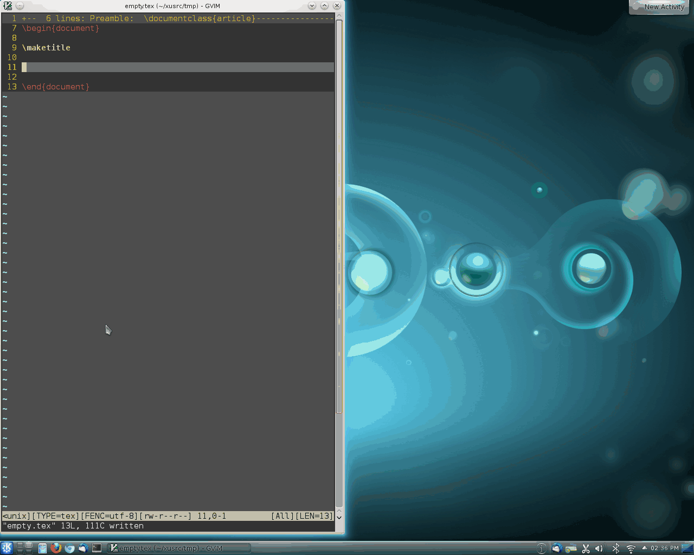

# A Vim Plugin for Lively Previewing LaTeX PDF Output

**NOTE** This vim plugin was written by **@xuhdev**. Unfortunately, her/his account no longer exists.  I've pushed this to my repo to keep it available for all the `vim` and LateX users! I repeat, I am not the originator of this repo. I'm just a vim user who wanted to keep this alive!

##Overview

This plugin provides a live preview of the output PDF of your LaTeX file. The
display of the output PDF file will be updated lively as you type (just hold
the cursor and you will see the PDF file updated). Currently,
vim-latex-live-preview only support UNIX-like systems. Please let me know if
you have any suggestions.

## Installation

Before installation, you need to make sure your Vim version is later than 7.3,
and is compiled with `+python` feature.

You have a few options for installation:
- Plugin Manager (Vundle, Pathogen, etc.)
- Manual Installation

###Plugin Manager Route

If you use `Vundle` you can add

	plugin 'nmante/vim-latex-live-preview'

to your `.vimrc` file. 

###Manual Installation

If you don't use a plugin manager, you can simply copy the `latexlivepreview.vim` file to your `~/.vim/plugin` folder.

By default, you need to have [evince][] or [okular][] installed as pdf viewers.
But you can specify your own viewer by setting `g:livepreview_previewer`
option in your `.vimrc`:

    let g:livepreview_previewer = 'your_viewer'
    
Mac OS X users can use Preview (default pdf viewer) for example:

	let g:livepreview_preview = 'open -a Preview'

Please note that it's possible not every pdf viewer will work well with this plugin. Evince, okular and OS X Preview are known to work well.

## Usage

Simply execute `:LLPStartPreview` to launch the previewer. Then try to type in
Vim and you should see the live update. The updating time could be set by Vim's
['updatetime'][] option. If your pdf viewer crashes when updates happen, you can
try to set 'updatetime' to a higher value to make it update less frequently. The
suggested value of 'updatetime' is `1000`.

## Screenshot

<!--
The screenshot is at ./screenshots/screenshot-evince.gif
-->

['updatetime']: http://vimdoc.sourceforge.net/htmldoc/options.html#%27updatetime%27
[evince]: http://projects.gnome.org/evince/
[okular]: http://okular.kde.org/
